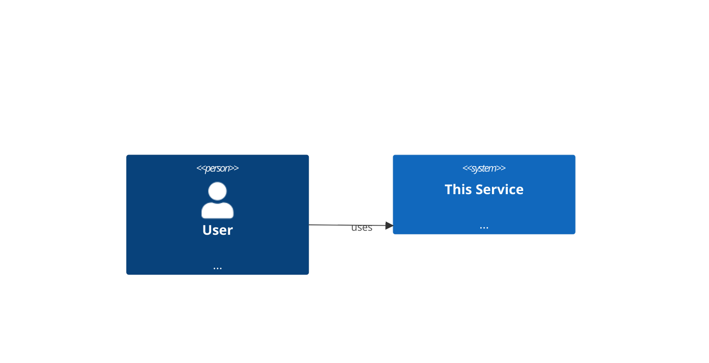
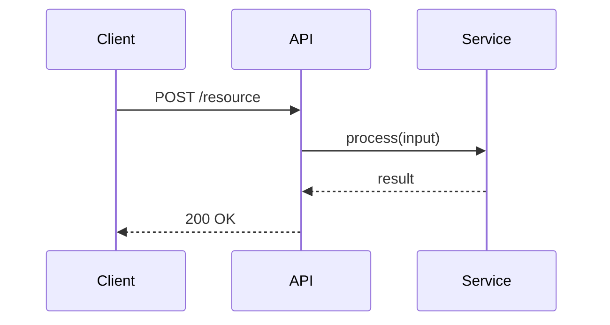

# Architecture: <Feature>

## 1. Context
_Why does this component exist? What problem does it solve? 1–3 paragraphs._

## 2. System Overview

## 3. Components

| Component | Responsibility | Location |
|---|---|---|
| `ExampleService` | Orchestrates LLM calls | `app/services/example/` |

## 4. Data Flow

## 5. Key Decisions
_Link to relevant ADRs._
- [ADR-NNN: Decision Title](adr-NNN-slug.md)

## 6. Non-Functional Requirements

| Concern | Target |
|---|---|
| Latency | p99 < 10s |
| Availability | 99.9% |

## 7. Open Questions / Future Work
- [ ] Item 1
