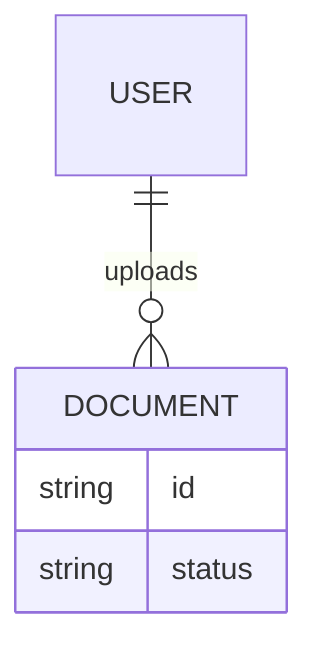
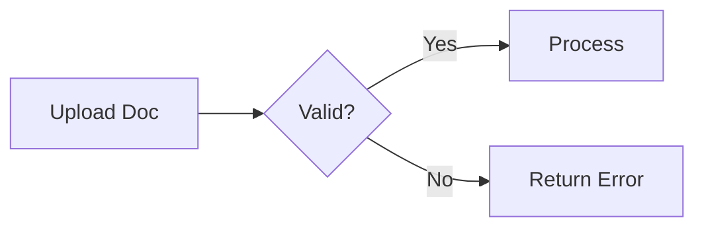

# BA Spec: <Feature>

## 1. Purpose & Scope
_What this feature does and what it does NOT do._

## 2. Stakeholders & Actors

| Actor | Role | Interaction |
|---|---|---|
| End User | Uploads document | Via web UI |

## 3. User Stories

| ID | Story | Priority | Acceptance Criteria |
|---|---|---|---|
| US-01 | As a user, I want to... | High | Given … When … Then … |

## 4. Business Rules
1. Rule 1: ...
2. Rule 2: ...

## 5. Data Model

## 6. Workflows / Process Flows

## 7. API Contract (summary)
_Full spec in `api-{feature}.md`._

## 8. Out of Scope
- ...

## 9. Glossary

| Term | Definition |
|---|---|
